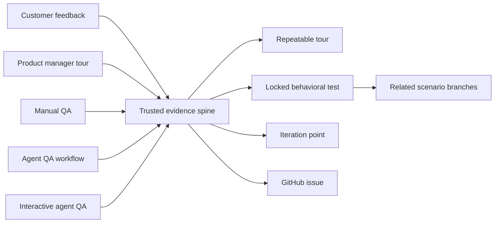

# Kitsoki Feedback

Kitsoki Feedback is a trusted evidence-to-behavior system. A candidate user
journey can arrive from a customer complaint, a product manager refining a
feature tour, a QA engineer testing manually, an autonomous agent QA campaign,
or an operator working interactively with an agent. Kitsoki preserves where it
came from, then standardizes it through one validated evidence path and format.

The reviewed journey can become:

- a repeatable product or What's new tour;
- a behavioral test that locks in an accepted product contract;
- an iteration point when product intent still needs a decision;
- a GitHub issue with trustworthy evidence;
- the root of a scenario family covering related roles, boundaries, failures,
  recoveries, and reported variants.

Source-specific capture remains visible in provenance. Standardization removes
incidental differences in tools and recording formats; it does not erase who
observed the behavior, which application revision ran, which evidence was
reviewed, or which assertions a person accepted.

When the browser or integrated library knows a request, trace, session, or
execution ID, the proposed [native Story evidence design](docs/requirements/reference-evidence-stories.md)
lets an application validate that reference and retrieve permitted records
through its own `.kitsoki` Story and Starlark. Custom bundles remain internally
bound to the issue; GitHub receives a safe summary and the assigned agent gets
issue-scoped access. This is a design requirement, not a shipped retrieval claim.

Capture can begin in either product mode:

- the Chrome extension works on sites that do nothing special;
- the embedded toolbar adds semantic anchors, typed context, and progressively
  richer application integration.

When both are present, the extension enriches the embedded report rather than
creating a second capture flow.

Start with the [Kitsoki Feedback guide](docs/guide/README.md):

- [setup, evidence storage, and GitHub](docs/guide/01-setup.md);
- [What's new and feature tours](docs/guide/02-whats-new-and-feature-tours.md);
- [collecting and triaging feedback](docs/guide/03-collect-and-triage.md);
- [product tours](docs/guide/04-product-tours.md);
- [interactive QA with agents](docs/guide/05-interactive-agent-qa.md);
- [repeatable scenario tests](docs/guide/06-repeatable-tests.md);
- [MCP, Starlark, and host surfaces](docs/guide/07-surfaces.md);
- [backend logs, distributed traces, and observability providers](docs/guide/08-observability-evidence.md).

Feedback is not mutation. The reviewed report is the artifact; a GitHub issue,
object-graph proposal, agent job, source change, or deployment is a governed
downstream outcome. Capture is opt-in, raw evidence stays local until review,
and each evidence item requires its own upload approval.

## License

Apache-2.0 — see [LICENSE](LICENSE).

<!-- BEGIN kitsoki:launch-policy (managed by pack/launch-policy/install.sh; edits inside are overwritten on upgrade) -->
## Agent operating principles (kitsoki launch policy)

This repository is governed by the parallel-agent gitflow. The rules are
mechanical, not advisory — the shims, hooks, and the landing story enforce
them. The capsule + merge-queue landing path is **retired**; fast-forward
landing through an isolated Git worktree replaces it:

- **Launch through the shims.** `claude` and `codex` resolve to
  `.kitsoki/bin/` wrappers (activate with `source .kitsoki/launch-policy.sh`;
  interactive shells can hook this on `cd`). Every launch passes
  `agent_launch_policy` preflight: this repo's root and its sibling repos
  are protected roots; agent work happens in an isolated worktree under
  `.worktrees/<name>` via `kitsoki agent launch --exec`, with
  `--profile sassfully-dev` as the sanctioned Story application entry.
- **Full-permissions agents are a last resort.** Use a sanctioned escape
  hatch only when the governed path cannot do the job — and file the gap that
  forced it (feedback or requirement node) so the workaround becomes
  unnecessary next time. The governed arm is `claude superagent` / `codex
  superagent`; `kitsoki agent launch --raw --interactive` is the underlying
  command. Whichever isolated working directory the shim materializes,
  landing from it is the fast-forward worktree flow below — direct
  `git commit`, no merge-queue wait. See
  `docs/guide/agents/launch.md` for the arms and their working directories.
- **Never edit a sibling repo.** Anything this repo needs from another is
  proposed as a typed requirement/bug node into that repo's federated
  catalog via `graph_propose`; its own fleet prioritizes it.
- **Work in a worktree, land by fast-forward.** `git worktree add -b
  <branch> .worktrees/<name> origin/staging/local`; commit there with plain
  `git commit` (worktrees are hook-exempt); land with `stories/land` or by
  hand — `git fetch origin`, `git rebase origin/<target>`, run the gate
  command (capsule CI is still the gate; in Kitsoki that is
  `bash scripts/capsule-ci-quick-gate.sh`), `git push origin
  HEAD:refs/heads/<target>`. The push is the only serialization point: it
  succeeds only as a fast-forward, so a losing racer is rejected and retries
  (refetch, rebase, re-gate, push again) rather than being overwritten. A
  rejected non-fast-forward push is an *expected* outcome of concurrent
  landing, not an error to escalate. Never force-push: a force-push to
  `staging/local` on 2026-07-31 silently dropped 116 landed commits.
  Protected `main` is never committed to directly; promotion to `main` (where
  applicable) happens on GitHub, gated on CI. Do not use `capsule submit`,
  `kitsoki queue *`, or `scripts/dev-workspace.sh` to land — that path is
  retired.
- **Every primary checkout is read-only — every repo's, not just this one.**
  A primary checkout is someone else's workspace: it carries other sessions'
  modified and untracked files, often on a branch unrelated to the integration
  branch, and this repo's is `chmod 444` besides. Never edit, commit, `git
  pull`, or check out a branch in one; cut a worktree first and do the whole
  job there, including the steps that "resolve naturally" in the primary tree.
  On 2026-08-11 a SOPS secrets file was edited in a primary checkout because
  `sops` and `.sops.yaml` resolved there, then had to be copied into a worktree
  to commit — one rule (worktree-only) beats two (worktree-except-when-awkward).
  If a tool only resolves its config from the primary root, run it with an
  explicit config path against the worktree, and file the gap.
- **Never answer "what does this repo do today" from a checked-out file.**
  `git show origin/<branch>:<path>`, after `git fetch origin` if the ref is
  cold. A primary checkout can be arbitrarily far behind: on 2026-08-11 a
  workflow file read from one 78 commits behind produced a wrong statement to
  the operator that a change had no automatic deployment path, when the landed
  file had carried the trigger all along. The `SessionStart` advisory prints
  each checkout's distance from its upstream; when it is silent that checkout
  is level and clean, and only then.
- **Never add a backend to an application.** A Kitsoki application is
  `app.yaml`, Starlark, a component package and taxonomy — that is the whole
  list. No Node or Express server, no Python service, no shell behind an
  endpoint, no `.mjs` carrying logic, no worker, no sidecar, no "thin
  adapter". Not for a proof of concept, not for a prototype, not for a spike,
  not "temporarily": those four words have justified every prior instance and
  none of them stayed temporary. **If the story cannot express it, the
  capability is missing from the Go service, and adding it there is the
  task** — reporting *"this needs a Kitsoki capability, here is precisely
  what and where"* is the correct outcome, not a blocked agent, and not
  permission to build something else instead. Presentation JavaScript is
  fine: Vue SFCs in a component package, and the browser-native `.mjs` that
  package legitimately ships.
  The prohibition is on **logic and services** — control flow, data
  access, validation, orchestration, persistence, business rules — and a Vue
  component that decides control flow has already crossed the line, which
  `presentation: custom` makes easy to do by accident, since the web surface
  does not enforce `app.yaml`'s card bindings there. Build and check tooling
  is not an application and is not covered, though the direction of travel is
  the same: meaningful commands belong in `kitsoki`, not Make or shell.
  Vendored third-party assets already in the tree stay; adding a new one is a
  decision to raise. If you believe a case warrants an exception, **ask the
  operator before writing it** — afterwards it exists, and removing it is a
  negotiation.
- **Never background a long command and end your turn waiting to be
  notified.** Backgrounded work does not wake a subagent — you will wait
  forever, and on 2026-08-11 two agents did, ~20 minutes each. Run gates and
  other long commands in the **foreground**, or background them and *poll*
  their log to completion within the same turn. "I'll report back when it
  finishes" is not a turn ending; it is a stall.
- **Report only what you verified, and quote the evidence.** Give the failing
  test name and its assertion, the SHA, the count you actually recounted —
  not an exit code and not a summary of what you expected to happen. A
  flattering number needs the same check as a discouraging one: on 2026-08-11
  a sweep agent reported closing 21 PRs when it had closed 30. **"Pre-existing"
  is not "not a problem"** — say pre-existing *and* whether it is a real gap,
  because the same failure was waved away twice as unrelated and was in fact a
  genuine gap in a commit landed that morning. Where the operator gave you a
  hypothesis, **disproving it is a success**, and shipping a fix for a bug that
  is not there is the failure. Where you lack a capability the task needs,
  **refuse and name the missing capability** — an agent that declined for want
  of a `host.git.close_pr` rather than inventing a credentialed workaround did
  the right thing. That is the expected response, not an exceptional one.
- **Grep for an existing implementation before building a new mechanism.** On
  2026-08-11 a scratch-file exclusion was added as an `info/exclude` mechanism
  when the same policy was already implemented one layer down as `:(exclude)`
  pathspecs; the two collided, broke the lane outright, and killed a run that
  had already produced a correct fix. Search first, then extend what you find
  or say why it cannot be extended.
- **Never `git stash`.** The stash stack is repo-global, not worktree-scoped:
  every worktree shares one `refs/stash`, so a `pop` can take another agent's
  entry, land it in your tree, and drop theirs. Save your own work with
  `git diff HEAD > /tmp/<name>.patch`, take a baseline with a detached worktree
  (`git worktree add --detach .worktrees/<name>-baseline <sha>`), and use a
  second worktree when you need a clean tree. `list`/`show`/`store` stay
  allowed; the guard refuses the rest.
- **Disk is a first-class resource.** Worktrees have owners; remove one you
  are done with rather than leaving it behind — through the repo's supported
  removal path where it has one (in Kitsoki, `make worktree-remove
  NAME=<name> ARGS=--delete-branch`). A bare `git worktree remove` on a
  bootstrapped worktree fails on read-only staged files *after* unlinking the
  admin record, which leaves a directory git can no longer see; always
  `git worktree prune` if you ever remove one by hand.
<!-- END kitsoki:launch-policy -->
