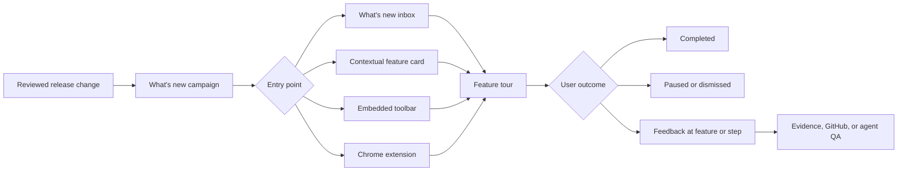
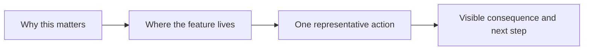
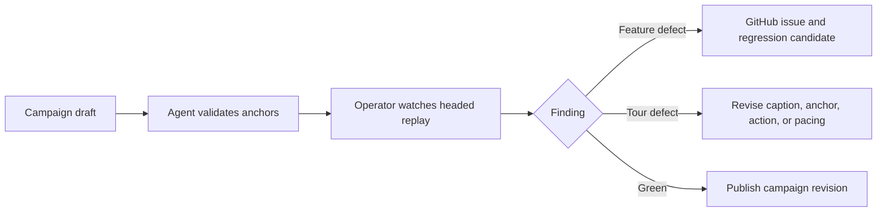

# What's new and feature tours

The proactive Kitsoki Feedback flow helps users discover and adopt product
changes. A release can announce itself through a What's new inbox, a compact
feature card, or a guided tour attached to the real product surface. The user
can start, pause, resume, dismiss, or give feedback without leaving the feature.

This uses the same machinery as contextual feedback:

- semantic anchors identify the feature;
- typed actions drive an optional tour;
- privacy policy controls any evidence;
- application and release identities make the experience reproducible;
- receipts record what was offered, started, completed, dismissed, or failed;
- feedback and QA stay linked to the exact campaign, tour revision, and step.

The flow is different. Feedback begins with a user reporting something;
What's new begins with a reviewed release campaign inviting discovery.



## Publish a What's new campaign

A campaign joins release intent to one or more product surfaces:

```yaml
version: kitsoki.feedback/feature-campaign/v1

id: team-invites-2026-08
title: Invite teammates with clearer roles
summary: Choose a role, preview access, and send an invitation from Team settings.

release:
  application: acme-console
  version: "2026.08.30"
  revision: sha256:8d4a...

audience:
  roles: [team-admin, owner]
  locales: [en]
  first_seen_after: "2026-08-30T00:00:00Z"

entry:
  surfaces: [whats-new, toolbar, contextual]
  anchor:
    route: team-settings
    component: invite-member-form

tour:
  ref: tours/team-invites-v1.json
  start: optional
  resume: true

feedback:
  kinds: [bug, usability, feature-request]
  attach_campaign: true
  attach_tour_step: true

completion:
  expires_after_days: 45
  show_once_completed: false
```

Publish it with:

```sh
kitsoki feedback campaign validate campaigns/team-invites.yaml
kitsoki feedback campaign publish campaigns/team-invites.yaml
```

Validation resolves the application, release identity, audience fields, entry
anchors, tour revision, feedback policy, and expiration. Publishing returns an
immutable campaign revision and receipt; editing the file requires a new
revision rather than changing what earlier users saw.

## Choose the entry point

### What's new inbox

Use the inbox for release notes and several related changes. Each item should
state the user benefit, affected role or workflow, and one next action. A tour
is optional.

### Contextual feature card

Use a contextual card when the user has reached the relevant surface but has
not used the feature. Anchor it to product meaning, not screen coordinates. The
card must not obscure the action it explains.

### Embedded toolbar

The toolbar shows an unread What's new state and opens the campaign without
navigating away. An integrated application supplies semantic identity, current
revision, role eligibility, and stable tour anchors.

### Chrome extension

The extension can deliver an approved feature tour to an enabled origin even
when the site has no Kitsoki integration. The campaign uses origin, path, and
page anchors rather than application semantics. It remains user-controlled and
does not inject on an origin that has not been enabled.

When an integrated toolbar is present, the extension contributes browser
capabilities to that experience; it does not display a duplicate campaign.

## Design the feature flow

A good feature campaign has four beats:



The announcement should work without the tour. The tour should deepen the
announcement rather than repeat it word for word.

Keep the tour optional unless the user cannot safely enter the changed workflow
without guidance. Never perform a destructive action merely to demonstrate it.

## Author the tour

Use the ordinary tour lifecycle:

1. Record a real journey against the exact release revision.
2. Select only the actions that explain the feature.
3. Replace incidental selectors with semantic or test anchors.
4. Write one concise caption and one idea per step.
5. Use synthetic values for any form interaction.
6. Validate every anchor against the target surface.
7. Preview in a headed browser.
8. Publish the validated tour revision into the campaign.

The MCP lifecycle remains `propose` → `validate` → `push`. Campaign publication
pins the resulting tour revision, so a later tour edit cannot change an active
campaign silently.

See [product tours](04-product-tours.md) for the script format, narration,
anchor healing, evidence controls, and tour QA.

## Let users control the experience

Every campaign supports:

- **Start tour** from the announcement;
- **Not now** without recording completion;
- **Resume** at the next incomplete step;
- **Dismiss** the campaign;
- **Replay** a completed tour from What's new;
- **Give feedback** at the campaign or current step.

Tour progress is scoped to the application, campaign revision, and user-safe
subject reference. Export-safe reports use a scoped pseudonym rather than a
stable cross-product identity.

Do not infer product approval from completion. A completion receipt proves the
steps ran; it does not prove the user understood or liked the feature.

## Capture feedback in the feature flow

The feedback button carries campaign context automatically:

```yaml
source:
  campaign: team-invites-2026-08
  campaign_revision: 3
  tour: team-invites-v1
  tour_revision: 1
  step: preview-role-access
  application_revision: sha256:8d4a...
```

The user still reviews the report and every evidence item. Campaign context
does not grant permission to upload replay, screenshots, or diagnostics.

This gives triage a precise distinction:

- the feature itself failed;
- the feature worked but the explanation was unclear;
- an anchor drifted and the tour pointed at the wrong place;
- the audience or timing was wrong;
- the user wants a related capability.

Route confirmed defects to GitHub with the campaign and step reference. Route
copy, pacing, targeting, and explanation problems to a new campaign or tour
revision. The original receipt remains unchanged.

## Use an agent to review a release

An agent can review a campaign interactively before publication:

1. Open the exact application revision in a headed QA browser.
2. Read the campaign and proposed tour revision.
3. Validate all semantic anchors.
4. Run one step at a time while the operator watches.
5. Compare each caption and narration beat with the visible consequence.
6. Record product defects separately from tour defects.
7. Save important journeys as scenario candidates.
8. File evidence-backed GitHub issues where appropriate.



The agent may recommend assertions, but the feature owner reviews product
intent before those assertions enter a repeatable test.

## Connect the tour to repeatable QA

The feature tour and the QA scenario share anchors and representative actions,
but they serve different audiences:

| Artifact | Optimized for | Success means |
| --- | --- | --- |
| What's new item | Discovery | The change and benefit are understandable. |
| Feature tour | Guided use | The reviewed steps completed on the intended surface. |
| QA scenario | Verification | Explicit product assertions passed with a complete receipt. |

For every action-bearing release tour, keep at least one scenario that verifies
the important consequence. Narration and pacing may change without rewriting
the behavioral contract.

See [repeatable tests](06-repeatable-tests.md) for scenario promotion.

## Common feature-tour patterns

### Release highlights

Group several changes in the What's new inbox. Give each item an independent
deep link and optional tour so users do not have to watch a release-wide demo.

### First-run onboarding

Introduce the smallest journey that reaches first value. Save advanced features
for contextual discovery after the user has the necessary state.

### Contextual discovery

Offer the tour when the user reaches the feature's surface and is eligible to
use it. Do not interrupt unrelated work with a global modal.

### Workflow migration

Explain what changed, preserve the old mental model long enough to orient the
user, then demonstrate the new action and visible consequence. Link migration
feedback to the exact old and new application revisions.

### Role-specific feature

Target abstract application roles rather than personal identifiers. Validate
the same tour and QA scenario for every eligible role binding.

### Re-engagement

Use a What's new item or subtle toolbar state for a feature the user skipped.
Respect dismissal and frequency policy; do not keep reopening the same tour.

## Receipts and measurement

Campaign receipts distinguish:

- eligible and offered;
- opened;
- tour started;
- step completed or failed;
- paused, resumed, dismissed, or completed;
- feedback opened and submitted;
- campaign expired.

Operational measurements use bounded, privacy-safe campaign and step
identities. They do not require raw session replay. Evidence capture is a
separate, explicit choice for diagnosis.

Use receipts to answer whether the flow executed and where it stopped. Use
research or reviewed feedback—not completion rate alone—to decide whether the
feature is useful.
