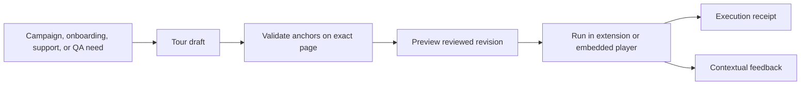

# Drive product tours

A Kitsoki Feedback tour is a reviewed, bounded script that explains a real
product surface and optionally performs typed actions. The same anchors used in
feedback and QA keep tours attached to product meaning rather than screenshot
coordinates.

The most common product flow publishes the tour from a **What's new** campaign:
the announcement explains why the change matters, and the tour shows where it
lives and how to use it. Tours also support onboarding, support walkthroughs,
release acceptance, documentation, and bug reproduction. See
[What's new and feature tours](02-whats-new-and-feature-tours.md) for campaign
targeting, entry points, progress, dismissal, and feedback-at-step behavior.

The `sassfully/demo-script/v1` wire identifier is retained for compatibility
with existing players and stored tours; the product name is Kitsoki Feedback.

Tours can run in two places:

- the Chrome extension can tour any enabled site, with no site integration;
- an integrated page can run a tour through its resident demo player and expose
  richer semantic anchors, narration controls, and evidence stamps.



## Tour format

```json
{
  "version": "sassfully/demo-script/v1",
  "steps": [
    {
      "id": "open-inbox",
      "spotlight": "[data-testid=feedback-inbox]",
      "caption": "Open the feedback inbox",
      "narration": "Every reviewed report arrives in one triage inbox.",
      "action": {
        "kind": "click",
        "selector": "[data-testid=feedback-inbox]"
      },
      "dwellMs": 900
    },
    {
      "id": "show-evidence",
      "spotlight": "[data-testid=evidence-manifest]",
      "caption": "Evidence stays itemized and reviewable",
      "narration": "The issue links to approved evidence by digest.",
      "dwellMs": 1400
    }
  ]
}
```

The action set is closed: `click`, `fill`, and `press`. A tour cannot evaluate
JavaScript, execute a shell command, or discover an action from prose while it
is running. Use synthetic values in `fill`; never put secrets or customer data
in a tour.

## Author a tour from a real journey

1. Start a feedback evidence recording.
2. Walk through the product once, speaking or writing the point of each step.
3. Stop recording and open the journey timeline.
4. Select the meaningful actions and consequences.
5. Choose **Create tour draft**.
6. Replace incidental selectors with semantic or test anchors.
7. Add one caption and one idea per step.
8. Validate against the exact open page.
9. Run the reviewed revision.

The recording accelerates authorship; it is not executed directly. The tour
draft contains only the selected, typed actions.

## Run a tour from the toolbar

Open **Feedback > Tours**, choose a tour, and select **Preview**. Preview checks:

- every anchor resolves exactly once;
- lower-ranked fallback anchors are reported as drift;
- every action is admitted by policy;
- the target application and revision are compatible;
- narration and evidence capture permissions are explicit.

Select **Run** after preview. The execution receipt records completed steps,
anchor drift, narration outcomes, and the exact tour revision. It does not claim
that physical speakers were audible.

## Run a tour through MCP

The embedded demo tool keeps draft authorship separate from page execution:

```jsonc
// Find an opt-in page.
{"action":"sessions"}

// Store revision 1 locally; nothing is sent to the page.
{"action":"propose","script":{"version":"sassfully/demo-script/v1","steps":[]}}

// Resolve every anchor against the exact page session.
{"action":"validate","sessionId":"SESSION","draftId":"DRAFT","revision":1}

// Run only the validated revision.
{"action":"push","sessionId":"SESSION","draftId":"DRAFT","revision":1}
```

These are arguments to the `embedded_demo` MCP tool. `update` uses compare and
swap and invalidates prior validation. `stop` cancels narration and clears the
presenter. A `push` result is an execution acknowledgement, not a visual QA
verdict.

For a zero-integration page, pair the extension tab first. Pairing authorizes
the bounded tour protocol for that tab; it does not grant a generic browser or
JavaScript evaluation interface.

## Validate a tour as QA

A tour proves that its anchors resolve and its scripted steps complete. Add
assertions when the product outcome matters. For example, a tour can click
**Save**, but a repeatable test should also assert that the saved banner appears
and the persisted value is visible after reload.

Use the tour as the narrative layer and a `test-flow/v1` scenario as the
behavioral proof:

| Artifact | Flow |
| --- | --- |
| Tour | Explain Settings, then click **Save**. |
| Test | Fill the value, click **Save**, assert the banner, reload, and assert the persisted value. |

The two artifacts may share semantic anchors and evidence, but they have
different contracts. A tour is designed for a person to understand; a test is
designed to produce an unambiguous pass or failure.

## Tour patterns

### Feature introduction

Frame the user goal, show the relevant surface, perform one representative
action, and dwell on the consequence. Avoid enumerating every control.

### Support walkthrough

Anchor the tour to a report or issue and start from the state the customer can
reach. Keep mutations harmless or use a disposable environment.

### Release acceptance

Run the narrative tour in a headed browser for review, then run the associated
scenario in a sealed environment. Retain both receipts.

### Bug reproduction

Create a short tour from the reviewed reproduction journey. Stop before the
failure would cause destructive or irreversible work. Pair it with a scenario
that asserts the defect and later the fix.

### Documentation tour

Prefer stable semantic anchors. Treat anchor healing as visible drift to fix,
not a reason to silently accept a tour that now points at a different control.

## Evidence during a tour

Evidence capture remains opt-in. `evidence_start` requires permission, and
`evidence_stop` freezes the bounded capture. Review and upload use the ordinary
feedback evidence workflow. A tour does not gain permission to upload evidence
merely because it was allowed to run.
