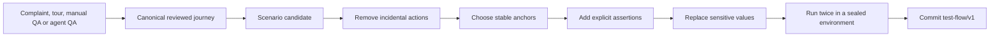
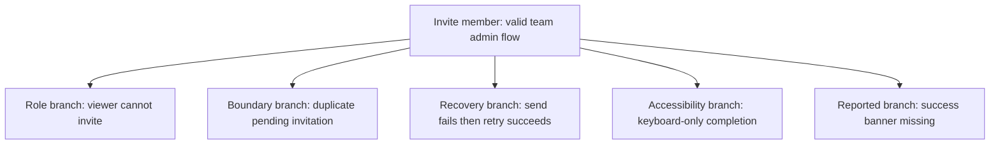

# Turn QA scenarios into repeatable tests

Kitsoki Feedback can preserve a journey from any admitted source immediately,
but it does not call that journey a test. Customer evidence, a product tour,
manual QA, an agent campaign and interactive agent QA all produce the same
scenario-candidate shape. A repeatable test additionally has a closed action
vocabulary, explicit approved assertions, a declared application target,
synthetic data, and a complete execution receipt.

## Promotion workflow



## 1. Save a scenario candidate

At the end of interactive QA, select **Save as scenario**. Kitsoki stores:

- the ordered typed actions;
- pre- and post-action semantic snapshots;
- evidence markers and screenshot references;
- target application identity and revision;
- actor provenance for operator and agent actions;
- suggested assertions, marked unapproved;
- the source report and issue references.

The same candidate is produced by **Lock behavior as test** from a product tour,
**Convert to scenario** from a complaint, or **Save journey** from manual or
agent QA. The source adapter changes; the candidate contract does not.

The candidate remains an artifact. It does not enter a gate.

For a Kitsoki story session, a trace can be converted through MCP:

```json
{
  "trace": ".kitsoki/sessions/SESSION/story-trace.jsonl",
  "app": "stories/acme-console/app.yaml",
  "out": "stories/acme-console/flows/invite-member.yaml",
  "recording": "stories/acme-console/fixtures/invite-member.cassette.json"
}
```

Pass that object to `trace.to_flow`, then review the generated flow and cassette
before running `story.test`.

## 2. Edit for intent

Delete actions that do not contribute to the behavior under test: exploratory
backtracking, accidental scroll, repeated clicks, narration, and inspection
steps. Keep the shortest journey that still expresses the user goal.

Replace brittle selectors in this order:

1. application semantic anchor;
2. stable `data-testid`;
3. accessible role and name;
4. stable text;
5. CSS selector as a last resort.

Anchor healing is visible in authoring, but a committed test should normally
use the intended highest-ranked anchor. Silent healing can make a test pass
against the wrong control.

## 3. Add assertions

Every scenario needs at least one product outcome assertion. Prefer assertions
that describe user-visible state:

- text equals or contains;
- value equals;
- element is present or absent;
- control is enabled or disabled;
- selected value;
- semantic snapshot or named artifact.

Avoid wall-clock assertions. Use `wait_for` with a bounded state transition,
then assert the resulting state.

## 4. Replace data and bind roles

Use synthetic values that satisfy the same type and validation rules:

| Source type | Synthetic or bound value |
| --- | --- |
| Email | `user-7km2q@example.test` |
| Person | `Person-81JAA` |
| Domain | `host-7dq92.example.test` |
| User role | `role:test-team-admin` |

Credentials use runtime role bindings such as
`credential:acme.test-team-admin`. Their values never enter the scenario,
cassette, trace, evidence manifest, or receipt.

## 5. Author the canonical Starlark test

The Starlark and MCP surfaces serialize the same `test-flow/v1` program:

```python
def main(ctx):
    tf = ctx.test_flow
    flow = tf.flow(
        id = "invite-member",
        description = "A team admin can invite a member with a valid role.",
        ops = [
            tf.navigate(id = "open", url = "/settings/team"),
            tf.wait_for(
                id = "ready",
                selector = '[data-testid="invite-member-form"]',
                state = tf.PRESENT,
                timeout_ms = 5000,
            ),
            tf.fill(
                id = "email",
                selector = '[data-testid="invite-email"]',
                value = "user-7km2q@example.test",
            ),
            tf.select(
                id = "role",
                selector = '[data-testid="invite-role"]',
                value = "viewer",
            ),
            tf.click(
                id = "submit",
                selector = '[data-testid="invite-submit"]',
            ),
            tf.wait_for(
                id = "await-success",
                selector = '[data-testid="invite-success"]',
                state = tf.PRESENT,
                timeout_ms = 5000,
            ),
            tf.expect(
                id = "success-text",
                selector = '[data-testid="invite-success"]',
                check = tf.TEXT_CONTAINS,
                expect = "Invitation sent",
            ),
            tf.screenshot(id = "final", name = "invite-member-success"),
        ],
    )
    return {"flow_json": flow.to_json()}
```

The story executes the serialized program with `host.test_flow.run`. The story
does not name a browser URL, provider token, or credential. The environment
selects the provider and records its exact identity in the receipt.

## 6. Prove repeatability

Run the scenario twice against the same sealed application bytes:

```sh
kitsoki test flows stories/acme-console/app.yaml \
  --flow stories/acme-console/flows/invite-member.yaml \
  --repeat 2
```

Both runs must produce the same canonical receipt content. Acquisition and
active timing may be logged separately; durations do not participate in the
deterministic receipt.

For MCP-driven validation, call `testflow.run` with the canonical flow bytes,
then `story.test` for the committed story suite. A missing browser or undeclared
capability is a refusal, never a skipped pass.

## 7. Link the test back to feedback

Add the report and issue references as scenario provenance:

```yaml
provenance:
  reports: [FB-01J8Y7M2Q]
  issues: [https://github.com/acme/acme-console/issues/418]
  evidence: [sha256:5ad1...]
```

The gate result updates the report timeline. Closing the GitHub issue can then
point to the committed scenario and its green receipt rather than to a manual
claim that the bug was fixed.

## Build a scenario family from one user flow

A scenario family keeps one accepted user journey as the root and expresses
related bugs or product questions as explicit branches. Branches reuse declared
setup and semantic anchors, but each has its own delta, assertions, provenance
and execution receipt.



Create a branch when the journey shares the root's product intent and setup but
changes a meaningful condition or expected outcome. Record the relationship:

```yaml
lineage:
  family: invite-member
  parent: invite-member/happy-path
  branch_reason: customer-reported-variant
  source_reports: [FB-01J8Y7M2Q]

delta:
  fixture: pending-invitation-exists
  expected: duplicate-invitation-warning
```

Do not duplicate the whole flow merely to change one condition. Do not force a
report into a family when it describes a different user goal. The family is a
traceable product model, not just a folder naming convention.

A new complaint can therefore:

- add evidence to an existing branch;
- reveal a missing branch;
- challenge the assertion and create an iteration point;
- prove that the root flow itself has regressed.

## Regression-test patterns

### Direct report regression

Reproduce one report, assert the failing symptom, fix the product, and retain
the same scenario as proof. Preserve the source report reference.

### Journey smoke test

Select the few user journeys that prove the application is usable. Keep them
short and independent; do not turn one smoke scenario into an end-to-end suite
that is impossible to diagnose.

### Parameter matrix

Run one canonical scenario over declared roles, locales, themes, or fixtures.
The matrix is data; do not copy and edit the action sequence for every case.

### Negative contract

Assert that a forbidden action remains unavailable, an invalid form does not
submit, or a lower-privilege role cannot see a control. Absence is a positive
assertion, not a missing assertion.

### Recovery contract

Use a deterministic cassette or environment fixture to produce a failure, then
assert the retry and recovered state. Never depend on a live third party being
unreliable at the right moment.

### Visual contract

Pair semantic assertions with a named screenshot artifact. Pin every visual
input and review changes deliberately; do not use an unbounded screenshot of a
customer session as the golden image.

### Tour conformance

For each action-bearing tour, keep a scenario that proves the important
consequence. The tour can change narration or pacing without rewriting the
behavioral contract.

## What not to promote

Do not commit a candidate when it:

- contains unreviewed text or evidence;
- uses real customer identifiers;
- depends on arbitrary JavaScript evaluation;
- encodes a secret or bearer value;
- has actions but no outcome assertion;
- relies on wall-clock duration;
- silently uses a different browser provider;
- writes to a shared production environment;
- passes only because an unsupported step was skipped.
