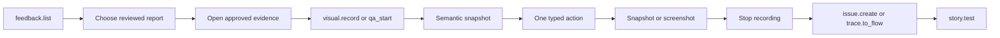

# MCP, Starlark, and host surfaces

Kitsoki Feedback exposes one typed service through three authoring surfaces:

- **MCP** is the interactive agent and tool-client projection.
- **Starlark** builds deterministic tours, policies, and test flows.
- **Host effects** execute governed external work and return receipts.

These are projections over the same report, evidence, tour, scenario, and
receipt contracts. They are not independent automation systems.

## Canonical journey envelope

Every source adapter emits `kitsoki.feedback/journey/v1`. The envelope is the
standard handoff between capture, review, tour authoring, QA and test promotion:

```yaml
version: kitsoki.feedback/journey/v1

source:
  kind: customer-feedback
  ref: FB-01J8Y7M2Q
  actor_class: customer

target:
  application: acme-console
  revision: sha256:8d4a...
  environment: customer-safe-replay
  role: team-admin

steps:
  - id: open-team-settings
    action: {kind: navigate, anchor: route:team-settings}
    observation: {kind: semantic-snapshot, digest: sha256:91b2...}

evidence:
  manifest: sha256:5ad1...
  review_receipt: REVIEW-01J8...

correlations:
  - handle: CORR-01J8Y8A1K
    kind: w3c-trace
    source: browser-otel
    handling: sealed_lookup
    window: {before: 30s, after: 90s}

assertions:
  suggested: [invitation-success-is-visible]
  approved: []

lineage:
  family: invite-member
  parent: invite-member/happy-path
  branch_reason: customer-reported-variant
```

Source adapters may collect different raw material, but they cannot omit the
same required identity, privacy, ordering, bounds and receipt checks. Suggested
assertions remain separate from approved assertions so normalization cannot
quietly turn an observer's interpretation into product policy.

The envelope contains evidence handles and digests, not raw sidecar bytes or
credential values. Tours and `test-flow/v1` are validated projections from this
envelope; neither invents a separate evidence format.

## Surface map

| Goal | MCP | Starlark / story | Durable result |
| --- | --- | --- | --- |
| Publish What's new | `feedback.campaign.validate`, `feedback.campaign.publish` | `ctx.feedback.campaign` + `host.feedback.campaign.publish` | immutable campaign revision and publication receipt |
| Report friction | `feedback.report`, `feedback.list` | reviewed feedback intake | report reference and routing results |
| Read reviewed application feedback | feedback inbox tools | `host.feedback.list_reviewed` | bounded reviewed projections and revision |
| Dispatch reviewed feedback | feedback dispatch tool | `host.feedback.dispatch` | durable job and application receipts |
| Observe and act in a browser | `embedded_demo` QA actions, `visual.*` | typed tour or `ctx.test_flow` ops | session/recording receipt |
| Author and run a tour | `embedded_demo` propose/validate/push | `sassfully/demo-script/v1` | tour revision and execution receipt |
| Run deterministic browser QA | `testflow.run` | `ctx.test_flow` + `host.test_flow.run` | complete `test-flow/v1` receipt |
| Convert a session to a fixture | `trace.to_flow` | committed flow/cassette | reviewable candidate files |
| Run story regression tests | `story.test` | story flow fixtures | deterministic test report |
| Store proof | `evidence.record`, `visual.record` | `host.flow_evidence` | immutable evidence handle and receipt |
| Plan a backend evidence read | `feedback.observability.plan` | `host.feedback.observability.plan` | bounded read plan with no telemetry records |
| Fetch correlated logs and traces | `feedback.observability.fetch` | `host.feedback.observability.fetch` | classified candidate evidence and provider receipts |
| File a defect | `issue.create` | configured GitHub issue filer | issue URL plus local/evidence receipts |

## MCP operating pattern

An agent should use the smallest surface that answers the question:



### What's new campaigns

`feedback.campaign.validate` checks release identity, audience policy, entry
anchors, the pinned tour revision, feedback-at-step policy, and expiration. It
does not publish or show anything to a user.

`feedback.campaign.publish` accepts only a validated revision. It stores an
immutable campaign, makes it eligible at its declared entry points, and returns
a publication receipt. Repeating the same publication identity returns the
same receipt; different content requires a new campaign revision.

`ctx.feedback.campaign` builds the same canonical campaign document inside a
story. `host.feedback.campaign.publish` owns the external effect. The story can
name semantic application and release identities, but it cannot supply a
credential, arbitrary delivery endpoint, or executable browser action.

The campaign references an ordinary validated tour revision. Its runtime
execution still uses `embedded_demo` or the extension player, so What's new does
not create a second tour engine.

### Feedback

`feedback.report` is non-blocking. It always attempts local durable capture
first. A GitHub or catalog routing failure is returned as structured routing
data and does not erase the report.

`feedback.list` returns reviewed summaries within the configured scope. Raw
sidecar bytes are never embedded in the listing.

### Embedded tours and QA

`embedded_demo` is a typed action multiplexer. Important actions are:

| Action | Purpose |
| --- | --- |
| `sessions` | List opt-in embedded page sessions. |
| `propose`, `update` | Create or compare-and-swap a local tour draft. |
| `validate` | Resolve anchors against an exact page and report drift. |
| `push`, `stop`, `resume` | Control an admitted tour revision. |
| `evidence_start`, `evidence_stop`, `evidence_export` | Control the page's opt-in capture. |
| `qa_start`, `qa_action`, `qa_stop` | Own a disposable browser and run bounded actions. |
| `qa_capture_start`, `qa_capture_export`, `qa_har_export` | Collect bounded, redacted QA telemetry. |

`qa_action` admits `snapshot`, `click`, `fill`, `press`, and `screenshot`.
Snapshots return a bounded semantic digest by default. Use full document detail
only when a digest cannot answer the question.

### Visual recording

Use `visual.record` around exploratory work likely to need human review. The
recording contains observations, actions, image identities, hashes, and a
masked replay when the surface supports it. Stop the recording before filing
an issue or saving a scenario so its manifest is complete.

### Issue filing

`issue.create` accepts a report body, labels, destination repository, stopped
visual recordings, trace context, and server-rendered assets. With
`sink: "github"`, the configured filer creates the issue. A filing failure
retains a local recovery ticket and returns its path.

### Trace conversion

`trace.to_flow` converts a recorded Kitsoki trace into a flow fixture and,
when needed, a host cassette. The result is deliberately a candidate: review
actions, data, and assertions before `story.test` and before committing it.

## Starlark test-flow vocabulary

`ctx.test_flow` is the canonical builder. Its operation set is closed:

```text
navigate
snapshot
click
fill
select
wait_for
expect
screenshot
artifact
```

Unknown operations and unknown fields are refused during validation. Starlark
does not receive a browser object, CDP session, provider URL, or credential.

The normal story shape is:

```yaml
hosts:
  - host.starlark.run
  - host.test_flow.run

states:
  ready:
    on:
      run:
        - target: execute
          effects:
            - invoke: host.starlark.run
              with: {script: scripts/scenario.star}
              bind: {flow_json: flow_json}
  execute:
    terminal: true
    on_enter:
      - invoke: host.test_flow.run
        with:
          flow_json: "{{ world.flow_json }}"
          app_name: acme-console
          app_version: "2026.08.30"
          bundle_digest: "sha256:..."
          bundle_source: "application:acme-console"
        bind: {receipt: receipt}
```

The environment resolves local Chromium or the exact leased provider. An
explicit lease that fails never falls back silently to a laptop browser.

## Feedback host boundary

Application stories use a deliberately narrow feedback host:

| Operation | Inputs | Returns |
| --- | --- | --- |
| `list_reviewed` | `scope`, `limit` | reviewed reports and revision |
| `dispatch` | `report_ref`, `dispatch_id`, `resume_mode`, `resume_workspace`, `retry_brief` | durable job ID and application receipts |

The loaded application supplies the authoritative scope. Callers cannot choose
an arbitrary repository, ledger, credential, provider, command, or filesystem
path. Only privacy-reviewed projections cross the boundary.

Dispatch is idempotent by `dispatch_id`. A completed dispatch replays its
stored receipt; reuse with different content fails. A daemon restart marks an
incomplete attempt as interrupted and requires an explicit retry rather than
claiming that process-bound work resumed.

The host can dispatch governed review or implementation work, but feedback
itself grants no graph authorization, source landing, deployment, or merge
authority.

## Evidence recording

Evidence is written in two phases:

1. persist the reviewed report and obtain its receipt;
2. upload each individually approved evidence item by report idempotency key
   and content digest.

Every evidence handle records:

- media type and byte size;
- content digest;
- privacy profile and review receipt;
- source application and revision;
- retention and destination policy;
- omission and truncation markers;
- optional report, issue, tour, scenario, and run references.

Evidence consumers receive handles. The evidence service resolves authorized,
short-lived reads; credentials never appear in MCP arguments or Starlark.

## Observability provider boundary

`feedback.observability.plan` accepts a reviewed correlation handle, requested
signals, and a narrower time window. The host resolves environment routing,
provider endpoints, indexes, buckets, namespaces, tenants, and credential roles
from project policy. The plan returns sources and hard limits but reads no
records.

`feedback.observability.fetch` accepts only an approved plan revision. Provider
adapters implement `capabilities`, `plan`, and `fetch`; they normalize results
to OpenTelemetry-shaped logs and spans where possible and return explicit
sampling, truncation, rotation, authorization, and partial-source status.
Fetched records remain quarantined candidate evidence until the ordinary
per-item review approves their exact digest for retention or agent access.

Neither MCP nor Starlark can supply provider query syntax, a shell command,
filesystem path, URL, credential, Kubernetes selector, index, or object prefix.
Local `rg` or `grep`, object-store reads, trace query APIs, and log-search APIs
remain host executor details. See [backend logs and traces](08-observability-evidence.md)
for configuration and operating patterns.

## GitHub routing

There are two related issue paths:

- `feedback.report` with a GitHub sink routes an already reviewed feedback item;
- `issue.create` lets an agent compose a defect from a QA session and bundle
  trace, visual recording, and rendered evidence server-side.

Both use the same configured GitHub authority and idempotent report reference.
Both preserve a local artifact when remote filing fails. Neither makes GitHub
the evidence store.

## Kitlark v2 integration

In a fully integrated application, the specification declares classification,
provenance, and replay behavior at the value boundary:

```yaml
feedback:
  values:
    request.body.email:
      classification: pii.email
      record: deterministic_substitute
      scope: report
    session.credential:
      classification: credential
      record: never
      replay_binding: credential:application.session
    request.id:
      classification: identifier.request
      record: preserve
```

The runtime propagates classifications through derived values and requires the
typed trace writer to apply the privacy transform before serialization. Generic
recognition remains a fail-safe for unstructured messages, not the primary
privacy mechanism.

This gives scenario replay type-correct synthetic values while preserving
within-report equality:

| Pseudonym | Synthetic replay value |
| --- | --- |
| `EMAIL:7KM2Q` | `user-7km2q@example.test` |
| `PERSON:81JAA` | `Person-81JAA` |

Credentials remain separate role bindings and are never converted into
pseudonyms.

## Receipts to retain

A complete feedback-to-regression workflow normally has:

1. report review receipt;
2. report storage receipt;
3. one receipt per uploaded or skipped evidence item;
4. GitHub filing receipt, when routed;
5. QA session and stopped-recording receipts;
6. scenario conversion receipt;
7. deterministic test-flow receipt;
8. story test report for the committed fixture.

These receipts make it possible to distinguish “captured,” “uploaded,”
“filed,” “reproduced,” and “protected by a repeatable test.”
