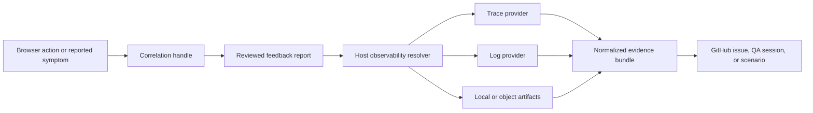
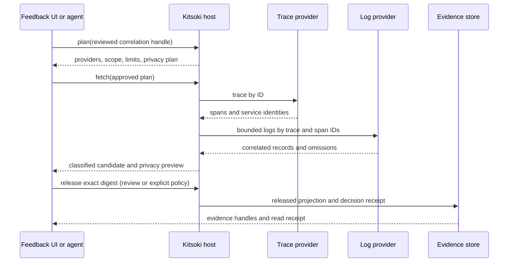

# Link feedback to backend logs and traces

> **Design guide:** the configuration, commands, UI actions, and observability
> APIs below describe the proposed telemetry integration, not verified shipped
> surfaces. Use the [native Story design](../requirements/reference-evidence-stories.md)
> as the governing contract for extensibility, authorization, release, and
> issue-scoped agent access.

## Start with an application-owned Story

Configure a normal Story in `.kitsoki/stories` to validate reporter references,
resolve records through permitted typed host operations, and build the bundle
your application needs. The reporter supplies a description and request/session
references; uploading logs is not required. Your Starlark defines application
entitlements and record relationships within host-enforced capability limits.

The following telemetry recipes are examples that such a Story can compose.
They are not a required plugin interface or a prerequisite vendor adapter list.
Before filing GitHub, the Story must satisfy the configured authoritative
evidence minimum and release a safe summary. The assigned bugfix job receives
the internal binding and permitted manifest, with further reads authorized by
issue/job scope. See the detailed design for lifecycle and refusal behavior.

Kitsoki Feedback can turn a request, trace, session, execution, or provider ID
known at the point of feedback into reviewed backend evidence. The same path
works whether telemetry is in a local artifact, an S3-compatible bucket,
Elasticsearch, Grafana Loki, Jaeger, Grafana Tempo, or Kubernetes pod logs.

The browser does not query those systems. It contributes a reviewed correlation
handle; the Kitsoki host resolves that handle through a configured, read-only
Story. The bounded result requires an exact-digest release decision through
review or explicit policy before retention, GitHub projection, or agent access.



## Use existing observability identity

Prefer these correlation kinds in order:

1. W3C trace ID, plus span ID when the browser knows the precise operation;
2. application request or operation ID that backend telemetry also records;
3. session, execution, conversation, or job ID scoped to an environment;
4. provider request ID;
5. a narrow timestamp, route, service, and environment window when no unique ID
   exists.

OpenTelemetry log records have explicit `TraceId` and `SpanId` fields, so logs
from different services can join the distributed trace without vendor-specific
field guessing. Application IDs remain useful: a request ID can find the first
server log record, which reveals the trace ID used for the rest of the lookup.

Do not use email, account name, free-text error messages, IP address, or other
customer data as a correlation key when a technical identifier is available.

## Connect the browser

### Existing browser OpenTelemetry

If the application already uses OpenTelemetry JavaScript, register the Kitsoki
bridge with the application's existing web tracer provider. The bridge is a
non-exporting span processor: it retains a bounded local ring of span identity,
timing, status, and approved low-risk attributes so the reporter can offer the
fetch or XMLHttpRequest associated with the symptom.

```js
const provider = new WebTracerProvider({
  spanProcessors: [
    applicationExporterProcessor,
    feedback.openTelemetrySpanProcessor({window: "90s"}),
  ],
});
```

Kitsoki does not install a second tracer provider or exporter. Existing
document-load, user-interaction, `fetch`, and XMLHttpRequest instrumentation can
continue exporting through the application's OTLP pipeline. Kitsoki retains the
identity needed to retrieve that telemetry later. If integration starts after
provider creation, `feedback.registerCorrelationProvider` can still read the
currently active span, but it cannot reconstruct already-finished fetch spans;
the span-processor integration is preferred.

Configure the application's HTTP instrumentation to propagate W3C trace context
only to intended API origins. Cross-origin propagation also requires the
application's normal CORS policy to admit the tracing header. Kitsoki does not
widen either allowlist.

OpenTelemetry's browser client instrumentation is currently experimental. The
bridge therefore depends only on the standard span context, not on a particular
instrumentation package's span names or attributes.

### Request ID response headers

For an application without browser tracing, allowlist a response header that
the backend also writes to logs:

```yaml
capture:
  correlation_headers:
    - name: x-request-id
      kind: application-request
      origins: [https://api.acme.example]
      handling: sealed_lookup
```

The embedded library can observe the header through the application's fetch
wrapper. The Chrome extension can observe only the configured names for enabled
origins. Neither mode captures all response headers.

In extension-only mode, browser process isolation means the extension does not
read an application's in-memory OpenTelemetry SDK. It uses allowlisted network
headers or an explicitly exposed Kitsoki bridge. Installing the embedded
integration enables the span-processor path above.

If the page cannot read the header because of browser policy, call the typed
integration directly after the response:

```js
feedback.correlate({
  kind: "application-request",
  value: response.headers.get("x-request-id"),
  service: "accounts-api",
  observedAt: new Date().toISOString(),
});
```

## Telemetry shape and API boundary

Use the [OpenTelemetry-aligned telemetry profile](../requirements/reference-evidence-stories.md#opentelemetry-aligned-telemetry-profile)
for log/trace bundle payloads: retain the appropriate signal fields, resource,
instrumentation scope, typed attributes, and correlation identities where
permitted. Other custom bundles remain application-defined. Redacted projections
record omissions; their familiar telemetry shape does not prove completeness
or authorize access.

OTLP exports telemetry over gRPC or HTTP. It is not a REST query API for
retrieving an issue's historical logs. Keep JSON-RPC for feedback and Story
control, and let your configured Story use authorized typed host reads against
the existing backend. Reuse your SDK and Collector pipeline.

## First POC target

The [agreed first POC](../requirements/reference-evidence-stories.md#first-poc-grafana-loki-queries-opentelemetry-log-evidence)
uses Grafana Loki's LogQL `query_range` API and an OpenTelemetry LogRecord
projection. A normal `.kitsoki` Story validates the authenticated session/request
relationship before host-bound tenant/service/time-limited queries. It then
releases a safe issue summary and supplies issue-scoped evidence to the assigned
bugfix agent. This target is proposed work, not shipped Loki support.

The POC reuses the existing Loki authentication gateway and query language.
It does not require replacing the logging stack or standardizing every custom
bundle as telemetry. Preserve mapping losses: Loki results cannot always
reconstruct the original OpenTelemetry record or attribute types.

## Configure providers

Provider configuration names data locations and credential roles. Reports,
tours, agents, and Starlark never receive provider credentials.

```yaml
observability:
  providers:
    - name: production-traces
      kind: tempo
      endpoint: https://tempo.example.net
      credential_role: observability.tempo.read

    - name: production-logs
      kind: loki
      endpoint: https://loki.example.net
      credential_role: observability.loki.read

  routes:
    - environment: production
      traces: production-traces
      logs: production-logs
      max_window: 10m
      max_records: 500
      max_bytes: 2097152
```

Bind credentials through the runtime and verify read-only access:

```sh
kitsoki credential bind observability.tempo.read
kitsoki credential bind observability.loki.read
kitsoki feedback observability verify production-traces
kitsoki feedback observability verify production-logs
```

Verification reports authentication, capabilities, enforced bounds, and a
provider receipt. It performs no unbounded search and does not treat an empty
test query as proof that access works.

## Generic provider contract

A telemetry Story can use these three optional operation conventions:

| Operation | Purpose | Durable result |
| --- | --- | --- |
| `capabilities` | Declare signals, supported correlation kinds, and hard limits. | Capability revision. |
| `plan` | Bind a reviewed handle to an administrator-defined query template and scope. | Read plan with no records. |
| `fetch` | Execute the read-only bounded plan and normalize results into review quarantine. | Candidate evidence manifest and source receipt. |

An agent may choose a correlation handle and request a smaller time window. It
cannot author Elasticsearch DSL, LogQL, TraceQL, shell, a bucket key, Kubernetes
selectors, or a provider URL. Those are reviewed provider templates.

The normalized result uses OpenTelemetry-shaped logs and spans where the source
maps cleanly. Provider-specific fields remain namespaced attributes. Every
result records sampling, truncation, rotation, inaccessible services, omitted
fields, and continuation state.

## Starting provider adapters

| Adapter | Lookup | Notes |
| --- | --- | --- |
| Local artifacts | Literal request, trace, session, or execution ID in bounded JSONL, NDJSON, or text files. | Uses an indexed literal search or bounded `rg`/`grep` executor; returns matching lines with file digest and line provenance. |
| S3-compatible | Reviewed manifest or prefix template plus correlation and time partition. | Covers Amazon S3, Cloudflare R2, MinIO, and compatible stores; object versions and digests make reads reproducible. |
| Jaeger v2 | Trace by W3C trace ID, then service/span projection. | Jaeger v2 is built on the OpenTelemetry Collector framework and exposes query APIs and UI over its trace store. |
| Grafana Tempo | Trace by ID or an administrator-defined TraceQL template. | Pair with Loki to retrieve logs by trace/span ID. |
| Grafana Loki | Bounded LogQL range query using configured labels and the correlation field. | Time, records, bytes, and tenants are host-bound. |
| Elasticsearch | Bounded term query over mapped `trace.id`, `span.id`, or approved application ID fields. | Index aliases and query templates are configured centrally. |
| Kubernetes | Current or previous logs for declared namespace, workload, pod, and container selectors. | Useful for immediate QA; durable cluster-level logging is preferred because pod logs rotate or disappear. |

OpenTelemetry Collector and OTLP are ingestion and normalization paths, not a
query store. Configure the backend that retains the signals—such as Jaeger,
Tempo/Loki, or Elastic—as the fetch provider.

## Fetch evidence from a report

From the feedback inbox, choose **Fetch backend evidence**, select a reviewed
handle, and accept or narrow the proposed window. The preview shows providers,
services, limits, and privacy transforms before the read.

Through MCP:

```json
{
  "report_ref": "FB-01J8Y7M2Q",
  "correlation_handle": "CORR-01J8Y8A1K",
  "signals": ["traces", "logs"],
  "window": {"before": "30s", "after": "90s"}
}
```

`feedback.observability.plan` returns the proposed read. After approval,
`feedback.observability.fetch` returns a classified candidate, source receipt,
and privacy preview, never an ambient provider credential. Release the exact candidate digest through individual review or an explicit
policy authorizing that classified projection and audience before retention or
agent access.



## Kubernetes and microservices

In a microservice environment, propagate W3C trace context through ingress,
HTTP, RPC, messaging, and background-work boundaries. Emit resource identity
such as service name, deployment environment, Kubernetes namespace, pod,
container, and workload with each signal. Put `TraceId` and `SpanId` on log
records whenever an active span exists.

Kitsoki first retrieves the distributed trace. The trace identifies which
services participated and which spans failed or ran slowly. It then queries
only those services' logs inside the report window. A partial trace, unsampled
service, rotated pod log, or inaccessible tenant is shown explicitly in the
evidence manifest.

For a cluster without centralized logging, the Kubernetes adapter can capture a
bounded snapshot from current and previous containers. This is useful during
interactive QA but is not durable proof until Kitsoki stores the reviewed
snapshot in the evidence destination. Kubernetes itself does not provide a
cluster-level log storage backend.

## .NET and C# services

.NET tracing uses `System.Diagnostics.Activity`; an activity corresponds to an
OpenTelemetry span. OpenTelemetry .NET automatically populates log records with
the active activity's trace ID, span ID, and trace flags.

Configure ASP.NET Core, `HttpClient`, database, and messaging instrumentation,
then include an application request ID when compatibility with existing logs is
needed:

```csharp
using var scope = logger.BeginScope(new Dictionary<string, object>
{
    ["app.request.id"] = httpContext.TraceIdentifier,
    ["feedback.session.id"] = feedbackSessionId
});

logger.LogInformation("Invite member request accepted");
```

The active `Activity` supplies trace correlation; the scoped application fields
supply additional lookup handles. Return only the configured request ID to the
browser. Do not return trace baggage, credentials, user claims, or arbitrary
logging scopes.

The same pattern applies to Java, Go, Node, Python, and other OpenTelemetry
implementations: propagate trace context, correlate logs with the active span,
and expose only a safe technical lookup handle to feedback capture.

## Use the evidence in QA and GitHub

Fetched telemetry is another evidence item, not automatically trusted content.
After its classified projection and exact digest are released by review or
explicit policy, an interactive
agent can read the approved projection, identify the failing service or span,
and add one backend observation to the journey. A saved scenario retains the
evidence digest and correlation recipe, not production telemetry bytes.

GitHub receives a concise summary such as:

- request `CORR-...` resolved to trace `TRACE-...`;
- six services participated; one service was unsampled;
- the approved summary describes the failing span and error observations;
- evidence was fetched from Tempo and Loki for a 120-second window;
- an opaque internal binding resolves permitted evidence after authorization.

Missing telemetry is evidence too. A receipt distinguishes no matching records,
sampling, retention expiry, rotation, authorization refusal, provider failure,
and query truncation. Kitsoki never renders those states as a successful empty
result.

## Standards and provider references

- [OpenTelemetry logs and trace correlation](https://opentelemetry.io/docs/specs/otel/logs/)
- [OpenTelemetry JavaScript and browser status](https://opentelemetry.io/docs/languages/js/)
- [OpenTelemetry web auto-instrumentations](https://github.com/open-telemetry/opentelemetry-js-contrib/tree/main/packages/auto-instrumentations-web)
- [Jaeger v2 architecture](https://www.jaegertracing.io/docs/2.20/architecture/)
- [Grafana Tempo HTTP API](https://grafana.com/docs/tempo/latest/api_docs/)
- [Grafana Loki HTTP API](https://grafana.com/docs/loki/latest/reference/loki-http-api/)
- [Elasticsearch search API](https://www.elastic.co/docs/api/doc/elasticsearch/operation/operation-search)
- [Kubernetes logging architecture](https://kubernetes.io/docs/concepts/cluster-administration/logging/)
- [.NET OpenTelemetry observability](https://learn.microsoft.com/en-us/dotnet/core/diagnostics/observability-with-otel)
- [.NET log correlation](https://opentelemetry.io/docs/languages/dotnet/logs/correlation/)
