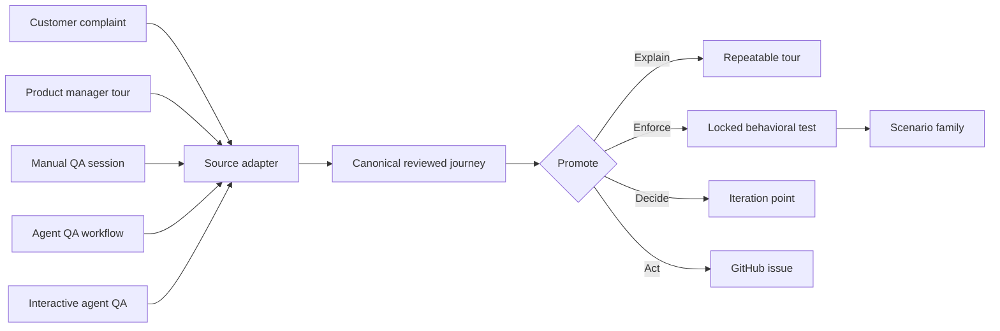
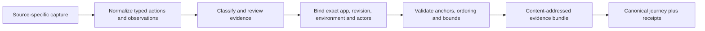

# Kitsoki Feedback guide

Kitsoki Feedback gives every candidate user journey the same trustworthy path
from observation to repeatable behavior. It does not matter whether the journey
starts as a customer complaint, a product manager's feature tour, a QA
engineer's manual session, an agent QA campaign, or an operator collaborating
with an agent interactively.

Each source keeps its provenance, but all sources normalize into the same
reviewed evidence and journey format. From there, a team can refine the journey
as a tour, lock accepted behavior into a deterministic test, treat an ambiguous
result as a product iteration point, file an evidence-backed GitHub issue, or
branch into related scenarios.

## One trusted evidence spine

Every source passes through the same trust boundary:

The normalized format preserves:

- source and actor provenance;
- exact application, release, environment, role and fixture identities;
- ordered typed actions and semantic observations;
- reviewed request, trace, span, session, and execution correlation handles;
- privacy classifications, substitutions, omissions and reviewer decisions;
- evidence digests and immutable storage receipts;
- proposed assertions separately from human-approved assertions;
- links to reports, campaigns, tours, GitHub issues and descendant scenarios.

That separation is why evidence from an agent is not trusted merely because an
agent produced it, and evidence from a person is not trusted merely because a
person watched it. Both become trustworthy through the same validation,
review, provenance and receipt contract.

## Choose a capture mode

| Mode | What the product must do | What Kitsoki Feedback can capture |
| --- | --- | --- |
| Chrome extension | Nothing. Enable the extension for an origin. | Page location, picked element, bounded replay, screenshot, console/error summaries, and network metadata. |
| Embedded toolbar | Mount the toolbar package. | Everything in extension mode plus application identity, semantic anchors, user/session-safe context, and host-defined evidence providers. |
| Integrated application | Declare feedback anchors, a privacy manifest, and test identities. | Typed provenance, stable semantic locations, business-object references, and higher-fidelity replay. |
| Kitlark v2 | Declare classifications and feedback/test contracts in the application specification. | Runtime-enforced classification, taint propagation, typed trace events, and deterministic synthetic replay. |

The extension detects an integrated page and becomes an evidence provider for
the embedded toolbar. It does not open a second reporter or create a second
report.

## Start here

1. [Set up a project, evidence destination, and GitHub](01-setup.md).
2. [Publish What's new and feature tours](02-whats-new-and-feature-tours.md).
3. [Collect and triage feedback](03-collect-and-triage.md).
4. [Author and run product tours](04-product-tours.md).
5. [Run interactive QA with an agent](05-interactive-agent-qa.md).
6. [Turn a QA journey into a repeatable test](06-repeatable-tests.md).
7. Use the [MCP, Starlark, and host reference](07-surfaces.md) when automating the
   workflow.
8. [Link feedback to backend logs and distributed traces](08-observability-evidence.md).

## The six durable objects

Kitsoki Feedback uses six linked objects rather than treating tours or bug
reports as disconnected blobs:

- A **campaign** declares the release, audience, entry points, pinned tour, and
  feedback policy for a What's new experience.
- A **tour** contains a reviewed revision of captions, semantic anchors, and
  optional typed actions.
- A **report** contains reviewed text, a semantic anchor, classifications,
  evidence metadata, and routing state.
- An **evidence bundle** contains approved sidecars such as replay, screenshot,
  console, network, correlated backend logs, and trace data. The report contains
  handles and digests, not raw bytes or provider credentials.
- A **scenario** is a reviewed `test-flow/v1` program with explicit actions and
  assertions. A replay alone is not a scenario.
- A **receipt** proves what was published, offered, completed, stored, uploaded,
  filed, or run. A successful command without a receipt is not durable
  completion.

The objects carry references to one another. That preserves the path from a
release campaign and tour step through feedback, evidence, GitHub, agent QA,
and the regression test that protects the resulting behavior.

## Safety defaults

- Capture is off until a person enables a site or an application opts in.
- Raw capture stays local until review.
- Input values are masked at capture time.
- Every evidence item has its own upload approval.
- Secrets and credential values are never represented in reports, traces,
  scenarios, or tours. Runtime credential roles are bound separately.
- GitHub receives reviewed prose and evidence references by default, not raw
  replay or HAR files.
- Unknown privacy classifications block submission.
- Agents receive released projections only. Browser evidence requires review;
  the proposed reference evidence path also permits explicit configured policy
  release for a bounded audience and purpose.

See [rich evidence sidecars](../requirements/rich-evidence-sidecars.md) for the
transport contract, [correlated observability evidence](../requirements/observability-evidence-providers.md)
for the backend retrieval boundary, and [extension mode](../requirements/extension-mode.md)
for the zero-integration capture boundary.

For the proposed request/session reference submission and issue-scoped agent
handoff, see [reference-backed feedback through native Stories](../requirements/reference-evidence-stories.md).
