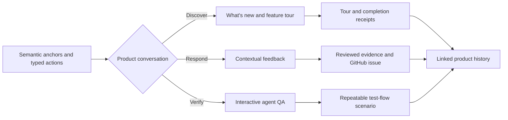
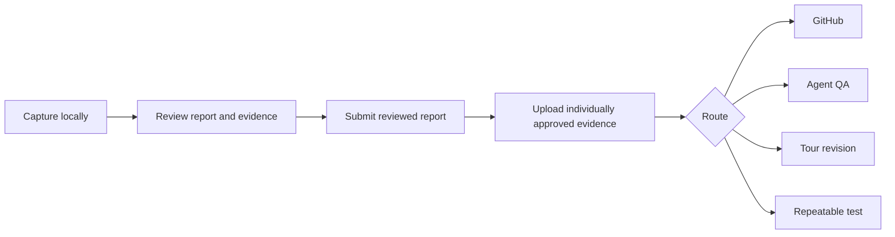

# Kitsoki Feedback guide

Kitsoki Feedback supports the whole product conversation, not only the moment
something goes wrong. A team can announce **What's new**, guide a user through
a feature, collect feedback at the exact step where it becomes useful, explore
the journey with an agent, and preserve the result as a repeatable test.

Feature discovery, feedback, and QA are different flows over the same
machinery: semantic anchors, typed browser actions, privacy-reviewed evidence,
GitHub routing, and durable receipts.

The reactive feedback lifecycle remains local and review-first:

## Choose a capture mode

| Mode | What the product must do | What Kitsoki Feedback can capture |
| --- | --- | --- |
| Chrome extension | Nothing. Enable the extension for an origin. | Page location, picked element, bounded replay, screenshot, console/error summaries, and network metadata. |
| Embedded toolbar | Mount the toolbar package. | Everything in extension mode plus application identity, semantic anchors, user/session-safe context, and host-defined evidence providers. |
| Integrated application | Declare feedback anchors, a privacy manifest, and test identities. | Typed provenance, stable semantic locations, business-object references, and higher-fidelity replay. |
| Kitlark v2 | Declare classifications and feedback/test contracts in the application specification. | Runtime-enforced classification, taint propagation, typed trace events, and deterministic synthetic replay. |

The extension detects an integrated page and becomes an evidence provider for
the embedded toolbar. It does not open a second reporter or create a second
report.

## Start here

1. [Set up a project, evidence destination, and GitHub](01-setup.md).
2. [Publish What's new and feature tours](02-whats-new-and-feature-tours.md).
3. [Collect and triage feedback](03-collect-and-triage.md).
4. [Author and run product tours](04-product-tours.md).
5. [Run interactive QA with an agent](05-interactive-agent-qa.md).
6. [Turn a QA journey into a repeatable test](06-repeatable-tests.md).
7. Use the [MCP, Starlark, and host reference](07-surfaces.md) when automating the
   workflow.

## The six durable objects

Kitsoki Feedback uses six linked objects rather than treating tours or bug
reports as disconnected blobs:

- A **campaign** declares the release, audience, entry points, pinned tour, and
  feedback policy for a What's new experience.
- A **tour** contains a reviewed revision of captions, semantic anchors, and
  optional typed actions.
- A **report** contains reviewed text, a semantic anchor, classifications,
  evidence metadata, and routing state.
- An **evidence bundle** contains approved sidecars such as replay, screenshot,
  console, network, and trace data. The report contains digests, not raw bytes.
- A **scenario** is a reviewed `test-flow/v1` program with explicit actions and
  assertions. A replay alone is not a scenario.
- A **receipt** proves what was published, offered, completed, stored, uploaded,
  filed, or run. A successful command without a receipt is not durable
  completion.

The objects carry references to one another. That preserves the path from a
release campaign and tour step through feedback, evidence, GitHub, agent QA,
and the regression test that protects the resulting behavior.

## Safety defaults

- Capture is off until a person enables a site or an application opts in.
- Raw capture stays local until review.
- Input values are masked at capture time.
- Every evidence item has its own upload approval.
- Secrets and credential values are never represented in reports, traces,
  scenarios, or tours. Runtime credential roles are bound separately.
- GitHub receives reviewed prose and evidence references by default, not raw
  replay or HAR files.
- Unknown privacy classifications block submission.
- Agents receive the reviewed projection unless a person explicitly grants a
  bounded evidence item for that session.

See [rich evidence sidecars](../requirements/rich-evidence-sidecars.md) for the
transport contract and [extension mode](../requirements/extension-mode.md) for
the zero-integration capture boundary.
