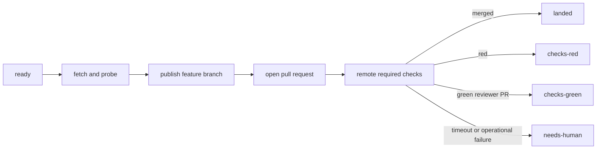

# `stories/land` — remote-CI landing

`sassfully-land` publishes a committed worktree branch, opens a pull request
into `origin/staging/local`, and waits for its remote required-check verdict.
It reports a confirmed merge as `landed`; a green reviewer-owned pull request
is `checks-green`, never a landing.

```
kitsoki run stories/land/app.yaml
```

Submit `land`. The pipeline accepts worktree identity and bounded wait policy:

| key | default | meaning |
|---|---|---|
| `worktree_path` | `.` | worktree holding the committed branch |
| `workspace_branch` | *(none)* | branch to publish |
| `target` | `staging/local` | remote integration branch; never checked out locally |
| `remote` | `origin` | Git remote |
| `max_attempts` | `5` | bound on remote-check waits |
| `arm_auto_merge` | `true` | false keeps a reviewer-owned PR open and returns its check verdict |
| `preserve_head_sha` | *(empty)* | optional immutable source identity for merge-parent verification |

The resolver build check is fixed by the authored pipeline as
`bash scripts/checks.sh`. It is not a caller slot or a caller-supplied world
value. Remote CI is the landing gate.

## Imported contract

The GitHub protocol is imported from `@kitsoki/land` under `ln`:



The wrapper fixes Sassfully's target and resolver check, then maps every
upstream terminal outcome. `exact-source-refused` stays distinct from a merge
when immutable source verification fails.

## Flow proof

`kitsoki test flows stories/land/app.yaml` runs five hermetic Story flows:

| fixture | proves |
|---|---|
| `lands.yaml` | only a confirmed remote merge maps to `landed` |
| `gate_red_needs_human.yaml` | remote check evidence maps to `checks-red`; no landing is claimed |
| `checks_green_is_not_landed.yaml` | reviewer mode never arms auto-merge and maps green checks to `checks-green` |
| `exact_source_refused.yaml` | an invalid exact-source merge method maps to `exact-source-refused` |
| `await_timeout_needs_human.yaml` | bounded waiting maps to `needs-human`, not success or failure |

The flows run through `scripts/checks.sh` with the same pinned Kitsoki source
used to validate the rest of the Sassfully Story applications.
